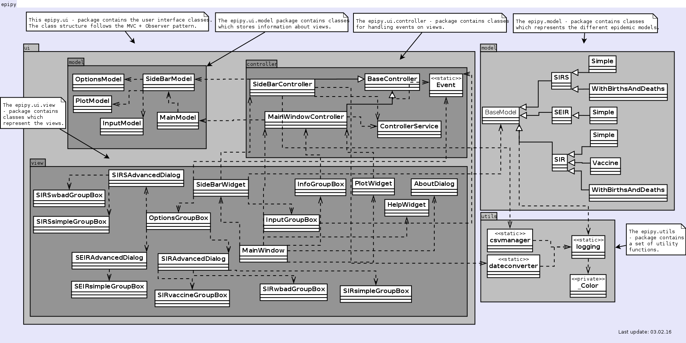

.. EpiPy documentation master file, created by
   sphinx-quickstart on Tue Dec  8 09:10:01 2015.
   You can adapt this file completely to your liking, but it should at least
   contain the root `toctree` directive.

EpiPy
=====

EpiPy is a Tool for fitting epidemic models. This tool is developed for the course
"Softwareprojekt Mobile Communication" at the Freie Universität Berlin.

Contents:

.. toctree::
   :maxdepth: 3

   model
   ui
   utils

Indices and tables
==================

* :ref:`genindex`
* :ref:`modindex`
* :ref:`search`

